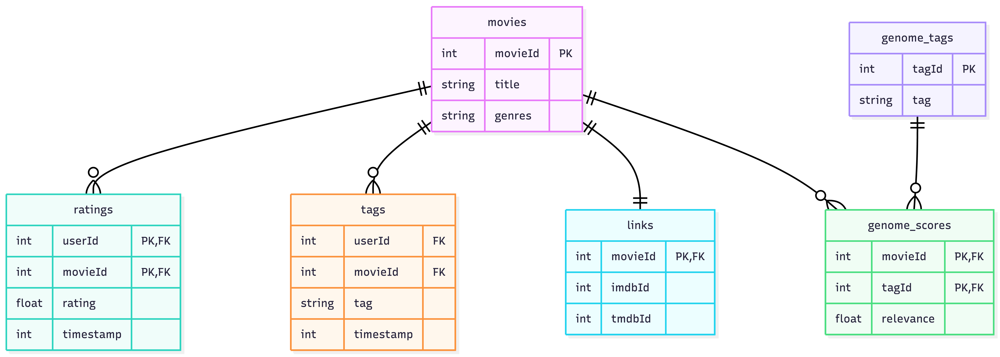

# DS 4320 Project 1: Reducing Popularity Bias in Movie Recommendations

This repository contains a fully constructed secondary dataset and analysis pipeline built on the MovieLens 25M dataset. The project studies popularity bias in movie recommendation systems, measuring how standard models favor popular films over lesser-known ones, and demonstrating a fairer evaluation approach. The dataset is structured using the relational model across six tables, stored as Parquet files, and analyzed using an SVD collaborative filtering model. All data, code, and documentation are organized here for full reproducibility.

| Spec | Value |
|:---|:---|
| Name | Margaux Reynolds |
| NetID | tsh3ut |
| DOI | [https://doi.org/10.5281/zenodo.19323558](https://doi.org/10.5281/zenodo.19323558) |
| Press Release | [Beyond the Top 10](press-release.md) |
| Data | [Link to Data](https://myuva-my.sharepoint.com/:f:/g/personal/tsh3ut_virginia_edu/IgDA9pm1MO0FTZ2dzjDRla-_AZf4-txDrfdUcu60VqIlKHw?e=0FA6AM) |
| Pipeline | [Analysis Code](pipeline/pipeline.ipynb) |
| License | [MIT](LICENSE) |

---

## Problem Definition

**General problem:** Recommending content (e.g. Netflix)

**Specific problem:** Identify the degree to which movie recommendation systems favor popular titles over lesser-known films in order to help build systems that better match individual user taste across the full catalog.

### Rationale

The general problem of content recommendation spans many platforms, content types, and user behaviors, making it too broad to address directly. Narrowing the focus to popularity bias in movie recommendations made it possible to study a concrete, measurable version of the problem using real data. The MovieLens 25M dataset, collected from the MovieLens platform, contains 25 million ratings from 162,000 users across 62,000 movies, alongside user-generated tags and a genome of relevance scores linking movies to descriptive attributes. That combination of explicit rating behavior and content-level features makes a fairness-aware recommendation approach realistic and well-supported. The specific focus on popularity bias emerged naturally from what the data revealed: a small fraction of movies account for the vast majority of all ratings, which means any model trained on this data will systematically underrepresent the rest of the catalog.

### Motivation

Popularity bias in recommendation systems has real consequences for users and content creators alike. On platforms like Netflix, Hulu, and Disney+, users are repeatedly shown the same well-known titles rather than discovering movies that genuinely match their taste, which reduces the value of the recommendation system over time. For independent filmmakers and smaller studios, algorithmic invisibility means their work never reaches the audiences most likely to appreciate it. The MovieLens dataset provides enough rating history to measure popularity distributions and identify long-tail movies with strong niche audiences, making it well-suited for studying this problem. The goal is not just a marginally better accuracy score but a clearer picture of where the bias comes from and what a fairer system would look like.

### Press Release Headline and Link

[Beyond the Top 10: How Streaming Platforms Are Hiding Movies You Would Actually Love](press-release.md)

---

## Domain Exposition

This project sits at the intersection of recommender systems research and algorithmic fairness. Streaming platforms rely heavily on machine learning to personalize what users see, with the goal of increasing engagement and satisfaction. The dominant approach, collaborative filtering, works by finding patterns in how users rate items and using those patterns to predict unseen ratings. While effective on average, these models are trained on data that is inherently skewed toward popular content, since popular movies accumulate far more ratings than obscure ones. This creates a feedback loop where popular items get recommended more, which generates more ratings, which makes them even more dominant in future model training. The MovieLens dataset was collected by the GroupLens research lab at the University of Minnesota and is one of the most widely used benchmarks in recommender systems research. The 25M version is particularly well suited for studying popularity bias because its scale makes the imbalance between popular and long-tail movies clearly visible in the data.

### Terminology
| Term | Definition |
|:---|:---|
| Collaborative Filtering | A recommendation approach that predicts a user's preferences based on the ratings and behavior of similar users |
| Catalog Coverage | The percentage of the total item catalog that appears in a system's recommendations, used to measure how well a recommender surfaces diverse content beyond popular items |
| Matrix Factorization | A technique that decomposes the user-item rating matrix into lower-dimensional representations to uncover latent preferences |
| Long-Tail Items | Movies with relatively few ratings that are underrepresented in standard recommendation outputs |
| Popularity Bias | The tendency of recommendation models to favor frequently-rated items regardless of individual user preference |
| RMSE | Root Mean Squared Error, which measures the average difference between predicted and actual ratings |
| User-Item Matrix | A matrix where rows are users, columns are items, and values are ratings, typically very sparse |
| Tag Genome | A MovieLens-specific feature set that scores every movie on hundreds of descriptive attributes based on user-generated tags |
| SVD | Singular Value Decomposition, a matrix factorization method used to uncover latent preference patterns in rating data |
 
---

### Background Readings

| # | Title | Description | Link |
|:--|:------|:------------|:-----|
| 1 | Harper & Konstan (2015). The MovieLens Datasets: History and Context. *ACM TiiS.* | Introduces the MovieLens datasets, their collection methodology, and how they have been used in recommender systems research | [PDF](https://myuva-my.sharepoint.com/:b:/g/personal/tsh3ut_virginia_edu/IQCiipwxFUVQQ4BuzbMFVRt4AdhrBzFjyS2Jh_dPHolPr1A?e=b9TQ1K) |
| 2 | Klimashevskaia et al. (2024). A Survey on Popularity Bias in Recommender Systems. *User Modeling and User-Adapted Interaction.* | Comprehensive survey covering why popularity bias emerges in collaborative filtering and how it has been measured and mitigated | [PDF](https://myuva-my.sharepoint.com/:b:/g/personal/tsh3ut_virginia_edu/IQCQxHQnwzzdS6u3UjQ0z2F4ART3EoH8BzEWBJO2tEBVD7g?e=wk6kRw) |
| 3 | Abdollahpouri et al. (2019). The Impact of Popularity Bias on Fairness and Calibration in Recommendation. *arXiv.* | Directly uses MovieLens to show how collaborative filtering amplifies popularity bias and reduces recommendation fairness | [PDF](https://myuva-my.sharepoint.com/:b:/g/personal/tsh3ut_virginia_edu/IQD8hWGfiiwxRYMjk9beY2p8AYo5DFxNUMzQCkCbJ0Xeskk?e=gHnGjE) |
| 4 | Abdollahpouri et al. (2019). Managing Popularity Bias in Recommender Systems with Personalized Re-ranking. *arXiv.* | Proposes a re-ranking approach to reduce popularity bias after initial recommendations are generated | [PDF](https://myuva-my.sharepoint.com/:b:/g/personal/tsh3ut_virginia_edu/IQAbpMjl8GhfRJCbLOmj-jYHASnGF3nDpEQoFeg89PIfwV0?e=gxnwsC) |
| 5 | Carnovalini et al. (2025). Popularity Bias in Recommender Systems: The Search for Fairness in the Long Tail. *MDPI Information.* | Recent narrative review examining popularity bias from a fairness perspective, with discussion of evaluation metrics | [PDF](https://myuva-my.sharepoint.com/:b:/g/personal/tsh3ut_virginia_edu/IQBBEF-Tm-xBSqc0DCkZT7lCARp8sUODGjM1r004Tfw3VBw?e=6Shax6) |

---

## Data Creation

The dataset was obtained from the GroupLens research lab at the University of Minnesota, which maintains and distributes the MovieLens datasets for research purposes. The MovieLens 25M dataset was downloaded directly from [grouplens.org/datasets/movielens/25m/](https://grouplens.org/datasets/movielens/25m/) as a zip file containing six CSV files: `ratings.csv`, `movies.csv`, `tags.csv`, `genome-scores.csv`, `genome-tags.csv`, and `links.csv`. No filtering or subsetting was applied at download and all files were retained in full. The dataset contains 25,000,095 ratings applied to 62,423 movies by 162,541 users, collected between January 9, 1995 and November 21, 2019. The CSV files were converted to Parquet format inside the pipeline notebook using DuckDB's `COPY TO` command for more efficient storage and query performance.

### Code

| File | Description | Link |
|:---|:---|:---|
| `pipeline/data_acquisition.ipynb` | Loads all six MovieLens CSV files into DuckDB, converts them to Parquet format, and verifies all tables loaded correctly | [pipeline/data_acquisition.ipynb](pipeline/data_acquisition.ipynb) |
| `pipeline/pipeline.ipynb` | Runs SQL queries to classify movies by popularity, trains an SVD collaborative filtering model, measures catalog coverage bias, and produces publication-quality visualizations | [pipeline/pipeline.ipynb](pipeline/pipeline.ipynb) |
| `pipeline/pipeline.md` | Markdown export of the analysis pipeline notebook | [pipeline/pipeline.md](pipeline/pipeline.md) |

### Bias Identification

Bias could be introduced into the MovieLens data at several points. First, the data reflects a self-selected user base. Only people who chose to use the MovieLens platform and actively rate movies are represented, so the user population skews toward engaged film enthusiasts rather than casual viewers. Second, ratings are subject to selection bias: users tend to rate movies they chose to watch, and people generally choose movies they expect to enjoy, meaning the dataset underrepresents negative experiences. Third, popular movies accumulate far more ratings than obscure ones simply because more users have seen them, which creates a structural imbalance that directly affects any model trained on this data.

### Bias Mitigation

The primary mitigation strategy is to explicitly measure and account for popularity bias rather than ignoring it. This means tracking the distribution of ratings per movie, distinguishing between long-tail and popular items throughout analysis, and evaluating the model on catalog coverage rather than just rating accuracy. Treating all unrated movies as missing rather than as implicit negative feedback also partially mitigates selection bias by avoiding penalizing the model for not recommending movies a user simply never encountered.

### Rationale for Critical Decisions

The most significant judgment call was choosing the MovieLens 25M version rather than the smaller 1M or 10M versions. The 25M dataset provides enough rating density to meaningfully measure popularity bias across the full long tail. Smaller versions compress the distribution and make the bias harder to observe. A second judgment call was defining the threshold between long-tail and popular movies at 500 ratings, a commonly used cutoff in the popularity bias literature that is ultimately arbitrary and directly affects how many movies are classified as long-tail. This threshold should be treated as a tunable parameter rather than a fixed boundary. Finally, retaining all six files without filtering preserves the full distribution needed to study the bias accurately, at the cost of including movies with very few ratings that add noise to the analysis.

---

## Metadata

### Schema
 

 
The dataset consists of six tables linked by `movieId` and `tagId` as foreign keys. The `movies` table is the central table, with `ratings`, `tags`, `links`, and `genome_scores` all joined to it on `movieId`. The `tags` table links users to movies via user-generated text labels. The `genome_scores` table links movies to tags via `tagId`, defined in the `genome_tags` lookup table. The `links` table provides cross-references from MovieLens `movieId` to external IMDB and TMDB identifiers.

 

### Data Tables
 
| Table | Description | CSV Link | Parquet Link |
|:---|:---|:---|:---|
| ratings | 25 million user ratings on a 5-star scale with half-star increments, one row per user-movie pair | [ratings.csv](https://myuva-my.sharepoint.com/:x:/g/personal/tsh3ut_virginia_edu/IQD7VChdg4cGQZFaMhUykKGQAXIm46ety09rCG-3PtAt4Bk?e=1Jowjz) | [ratings.parquet](https://myuva-my.sharepoint.com/:u:/g/personal/tsh3ut_virginia_edu/IQBFHfpz5petRZaFlAkQ7SfhAYFJ37hGwtQekkK2IW9xMzU?e=jsxdbC) |
| movies | Metadata for 62,423 movies including title with release year and pipe-separated genres |  [movies.csv](https://myuva-my.sharepoint.com/:x:/g/personal/tsh3ut_virginia_edu/IQCBMUPmMmx7RYSTt6bU9jCnAbNuWbHEpaicMdqBeUAil0s?e=Kh3IpW) |[movies.parquet](https://myuva-my.sharepoint.com/:u:/g/personal/tsh3ut_virginia_edu/IQCbrrJ7FEtbTa94CIJ-RlrGAXkZlbT8D0LGajRGSTCyaaU?e=nR1Kwn) |
| tags | User-generated text tags applied to movies, one row per user-movie-tag combination | [tags.csv](https://myuva-my.sharepoint.com/:x:/g/personal/tsh3ut_virginia_edu/IQAXDlp5VeI5RqX8ab8e5Q7wARVc5C1XxrsLKXG7rkZUhCw?e=0puT5v) | [tags.parquet](https://myuva-my.sharepoint.com/:u:/g/personal/tsh3ut_virginia_edu/IQDxF3kysUG-R72K97hrCtxHAXpltSlm85f_7-qwpPXvRuE?e=2DEVjd) |
| genome_scores | Tag relevance scores computed for every movie-tag combination | [genome_scores.csv](https://myuva-my.sharepoint.com/:x:/g/personal/tsh3ut_virginia_edu/IQCuNAbzsSNoS5l9U8nC-oUYAewYKvEx_tfJKVhNP_8Ibso?e=CITsYZ) | [genome_scores.parquet](https://myuva-my.sharepoint.com/:u:/g/personal/tsh3ut_virginia_edu/IQA6iuA76LihQ6C3TptZU3rXARz9_3giauabeZLmfuGt1No?e=4eAFZK) |
| genome_tags | Descriptive tag labels corresponding to tag IDs used in the genome scores table | [genome_tags.csv](https://myuva-my.sharepoint.com/:x:/g/personal/tsh3ut_virginia_edu/IQBU8yFsZiX6S4uF2qTJX4n4AaUHxJgrBhwLqNnjr80mYzc?e=MXxFDT) | [genome_tags.parquet](https://myuva-my.sharepoint.com/:u:/g/personal/tsh3ut_virginia_edu/IQBRxZs81FrXR6Q4Ikl_CS9jAcuKHfO2ySZIAoRzu_nZ5W0?e=DEWIxk) |
| links | MovieLens movie IDs linked to corresponding IMDB and TMDB identifiers | [links.csv](https://myuva-my.sharepoint.com/:x:/g/personal/tsh3ut_virginia_edu/IQBCi2A65PTfTIqL4V_lHaM2AbMLjGvoFjpA8aVhzfv_nbg?e=NAjNbR) | [links.parquet](https://myuva-my.sharepoint.com/:u:/g/personal/tsh3ut_virginia_edu/IQAVA1nMjVYHTaYVK9t70rRkAVyl3xKv2uY3pncQVh_c71I?e=kOi6Fo) | 
 
 

### Data Dictionary
 
| Feature | Table | Data Type | Description | Example |
|:---|:---|:---|:---|:---|
| movieId | ratings, movies, tags, genome_scores, links | int | Unique identifier for each movie | 1 |
| userId | ratings, tags | int | Anonymized identifier for a user | 1 |
| tagId | genome_scores, genome_tags | int | Unique identifier for each tag in the genome | 1 |
| title | movies | string | Movie title with release year in parentheses | Toy Story (1995) |
| genres | movies | string | Pipe-separated list of genres assigned to the movie | Adventure\|Animation |
| rating | ratings | float | User rating on a 5-star scale with half-star increments | 4.0 |
| timestamp | ratings, tags | int | Seconds since UTC epoch representing when the action was submitted | 964982703 |
| tag | tags | string | User-generated word or short phrase describing the movie | funny |
| imdbId | links | int | Identifier for the movie on IMDB | 114709 |
| tmdbId | links | int | Identifier for the movie on The Movie Database | 862 |
| relevance | genome_scores | float | Score between 0 and 1 indicating how strongly a movie exhibits a tag property | 0.025 |

 

### Uncertainty Quantification

Comprehensive uncertainty metrics for analytically relevant numerical features. Identifiers (movieId, userId, tagId, imdbId, tmdbId) and timestamps are excluded as they are technical fields rather than predictive features.

| Feature | Table | Mean | Std Dev | Min | Max | Median | Source of Uncertainty |
|:---|:---|:---|:---|:---|:---|:---|:---|
| rating | ratings | 3.53 | 1.06 | 0.5 | 5.0 | 3.5 | Subjective human judgments. Only users with 20+ ratings are included, truncating low-engagement users. The same user may rate the same movie differently at different times. |
| relevance | genome_scores | 0.12 | 0.15 | 0.0 | 1.0 | 0.06 | Computed by a machine learning algorithm trained on user-contributed content. Scores near 0.5 are ambiguous and inherit subjectivity from both tag and rating data. |