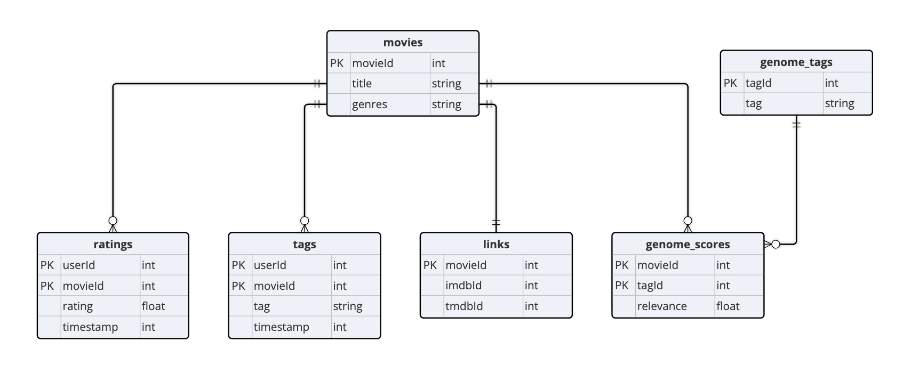

# DS 4320 Project 1: Reducing Popularity Bias in Movie Recommendations

This repository contains a fully constructed secondary dataset and analysis pipeline built on the MovieLens 25M dataset. The project studies popularity bias in movie recommendation systems, measuring how standard models favor popular films over lesser-known ones, and demonstrating a fairer evaluation approach. The dataset is structured using the relational model across six tables, stored as Parquet files, and analyzed using an SVD collaborative filtering model. All data, code, and documentation are organized here for full reproducibility.

| Spec | Value |
|:---|:---|
| Name | Margaux Reynolds |
| NetID | tsh3ut |
| DOI | [https://doi.org/10.5281/zenodo.19323558](https://doi.org/10.5281/zenodo.19323558) |
| Press Release | [Beyond the Top 10](press-release.md) |
| Data | [Link to Data](https://myuva-my.sharepoint.com/:f:/g/personal/tsh3ut_virginia_edu/IgDA9pm1MO0FTZ2dzjDRla-_AZf4-txDrfdUcu60VqIlKHw?e=0FA6AM) |
| Pipeline | [Analysis Code](pipeline/pipeline.ipynb) |
| License | [MIT](LICENSE) |

---

## Problem Definition

**General problem:** Streaming platforms struggle to make content recommendations that feel personal and expose users to a diverse range of relevant content.

**Specific problem:** Viewers receive recommendations that feel repetitive and generic rather than matched to their individual taste, often because recommendation systems prioritize widely rated or popular content, causing them to miss films they would have genuinely enjoyed.

### Rationale

The general problem of content recommendation is too broad to address directly since it spans many platforms, content types, and user behaviors, and the specific experience of receiving repetitive or impersonal recommendations needed a concrete dataset to study and measure. The refinement was driven by what the MovieLens 25M dataset actually contains: 25 million ratings from 162,000 users across 62,000 movies, alongside user-generated tags and a genome of relevance scores linking movies to descriptive attributes. That combination of explicit rating behavior and content-level features makes a fairness-aware recommendation approach realistic and well-supported by the data. The specific focus on popularity bias emerged naturally from what the data revealed: a small fraction of movies account for the vast majority of all ratings, which means any model trained on this data will systematically underrepresent the rest of the catalog.

### Motivation

Popularity bias in recommendation systems has real consequences for both users and content creators. Users are repeatedly shown the same well-known titles rather than discovering movies that genuinely match their taste, which reduces the value of the recommendation system over time. For filmmakers and smaller studios, algorithmic invisibility means their work never reaches the audiences most likely to appreciate it. The MovieLens dataset provides enough rating history to measure popularity distributions and identify long-tail movies with strong niche audiences, making it well-suited for studying this problem. The goal is not just a marginally better accuracy score but a system that works more fairly across the full catalog.

### Press Release Headline and Link

[Beyond the Top 10: How Streaming Platforms Are Hiding Movies You Would Actually Love](press-release.md)

---

## Domain Exposition

This project sits at the intersection of recommender systems research and algorithmic fairness. Streaming platforms rely heavily on machine learning to personalize what users see, with the goal of increasing engagement and satisfaction. The dominant approach, collaborative filtering, works by finding patterns in how users rate items and using those patterns to predict unseen ratings. While effective on average, these models are trained on data that is inherently skewed toward popular content, since popular movies accumulate far more ratings than obscure ones. This creates a feedback loop where popular items get recommended more, which generates more ratings, which makes them even more dominant in future model training. The MovieLens dataset was collected by the GroupLens research lab at the University of Minnesota and is one of the most widely used benchmarks in recommender systems research. Popularity bias is not just a technical problem but an equity problem, since independent films and underrepresented voices are disproportionately represented in the long tail of the catalog.

### Terminology
| Term | Definition |
|:---|:---|
| Collaborative Filtering | A recommendation approach that predicts a user's preferences based on the ratings and behavior of similar users |
| Content-Based Filtering | A recommendation approach that suggests items similar to ones a user has previously liked, based on item attributes |
| Matrix Factorization | A technique that decomposes the user-item rating matrix into lower-dimensional representations to uncover latent preferences |
| Long-Tail Items | Movies with relatively few ratings that are underrepresented in standard recommendation outputs |
| Popularity Bias | The tendency of recommendation models to favor frequently-rated items regardless of individual user preference |
| RMSE | Root Mean Squared Error, which measures the average difference between predicted and actual ratings |
| Precision@K | Proportion of recommended items in the top K results that are actually relevant to the user |
| Recall@K | Proportion of relevant items that appear in the top K recommendations |
| Coverage | Percentage of the total item catalog that a recommendation system surfaces across all users |
| User-Item Matrix | A matrix where rows are users, columns are items, and values are ratings, typically very sparse |
| Cold Start | The problem of making recommendations for new users or items with little to no historical data |
| Tag Genome | A MovieLens-specific feature set that scores every movie on hundreds of descriptive attributes based on user-generated tags |
| SVD | Singular Value Decomposition, a matrix factorization method used to uncover latent preference patterns in rating data |
 
---

### Background Readings

| # | Title | Description | Link |
|:--|:------|:------------|:-----|
| 1 | Harper & Konstan (2015). The MovieLens Datasets: History and Context. *ACM TiiS.* | Introduces the MovieLens datasets, their collection methodology, and how they have been used in recommender systems research | [PDF](readings/harper_konstan_2015.pdf) |
| 2 | Klimashevskaia et al. (2024). A Survey on Popularity Bias in Recommender Systems. *User Modeling and User-Adapted Interaction.* | Comprehensive survey covering why popularity bias emerges in collaborative filtering and how it has been measured and mitigated | [PDF](readings/klimashevskaia_2024.pdf) |
| 3 | Abdollahpouri et al. (2019). The Impact of Popularity Bias on Fairness and Calibration in Recommendation. *arXiv.* | Directly uses MovieLens to show how collaborative filtering amplifies popularity bias and reduces recommendation fairness | [PDF](readings/abdollahpouri_2019_impact.pdf) |
| 4 | Abdollahpouri et al. (2019). Managing Popularity Bias in Recommender Systems with Personalized Re-ranking. *arXiv.* | Proposes a re-ranking approach to reduce popularity bias after initial recommendations are generated | [PDF](readings/abdollahpouri_2019_managing.pdf) |
| 5 | Deldjoo et al. (2025). Popularity Bias in Recommender Systems: The Search for Fairness in the Long Tail. *MDPI Information.* | Recent narrative review examining popularity bias from a fairness perspective, with discussion of evaluation metrics | [PDF](readings/deldjoo_2025.pdf) |

---

## Data Creation

The dataset was obtained from the GroupLens research lab at the University of Minnesota, which maintains and distributes the MovieLens datasets for research purposes. The MovieLens 25M dataset was downloaded directly from [grouplens.org/datasets/movielens/25m/](https://grouplens.org/datasets/movielens/25m/) as a zip file containing six CSV files: `ratings.csv`, `movies.csv`, `tags.csv`, `genome-scores.csv`, `genome-tags.csv`, and `links.csv`. No filtering or subsetting was applied at download and all files were retained in full. The dataset contains 25,000,095 ratings applied to 62,423 movies by 162,541 users, collected between January 9, 1995 and November 21, 2019. The CSV files were converted to Parquet format inside the pipeline notebook using DuckDB's `COPY TO` command for more efficient storage and query performance.

### Code

| File | Description | Link |
|:---|:---|:---|
| `pipeline/pipeline.ipynb` | Loads all six MovieLens Parquet files into DuckDB, runs SQL queries to classify movies by popularity, trains an SVD collaborative filtering model, measures catalog coverage bias, and produces publication-quality visualizations | [pipeline/pipeline.ipynb](pipeline/pipeline.ipynb) |
| `pipeline/pipeline.md` | Markdown export of the pipeline notebook for easy viewing on GitHub without running code | [pipeline/pipeline.md](pipeline/pipeline.md) |

### Bias Identification

Bias could be introduced into the MovieLens data at several points. First, the data reflects a self-selected user base. Only people who chose to use the MovieLens platform and actively rate movies are represented, so the user population skews toward engaged film enthusiasts rather than casual viewers. Second, ratings are subject to selection bias: users tend to rate movies they chose to watch, and people generally choose movies they expect to enjoy, meaning the dataset underrepresents negative experiences. Third, popular movies accumulate far more ratings than obscure ones simply because more users have seen them, which creates a structural imbalance that directly affects any model trained on this data.

### Bias Mitigation

The primary mitigation strategy is to explicitly measure and account for popularity bias rather than ignoring it. This means tracking the distribution of ratings per movie, distinguishing between long-tail and popular items throughout analysis, and evaluating the model on catalog coverage rather than just rating accuracy. Treating all unrated movies as missing rather than as implicit negative feedback also partially mitigates selection bias by avoiding penalizing the model for not recommending movies a user simply never encountered.

### Rationale for Critical Decisions

The most significant judgment call was choosing the MovieLens 25M version rather than the smaller 1M or 10M versions. The 25M dataset provides enough rating density to meaningfully measure popularity bias across the full long tail. Smaller versions compress the distribution and make the bias harder to observe. A second judgment call was defining the threshold between long-tail and popular movies at 500 ratings, a commonly used cutoff in the popularity bias literature that is ultimately arbitrary and directly affects how many movies are classified as long-tail. This threshold should be treated as a tunable parameter rather than a fixed boundary. Finally, retaining all six files without filtering preserves the full distribution needed to study the bias accurately, at the cost of including movies with very few ratings that add noise to the analysis.

---

## Metadata

### Schema
 

 
The dataset consists of six tables linked by `movieId` and `tagId` as foreign keys. The `ratings` table is the central fact table joined to `movies` on `movieId`. The `tags` table links users to movies via user-generated text labels. The `genome_scores` table links movies to tags via `tagId`, defined in the `genome_tags` lookup table. The `links` table provides cross-references from MovieLens `movieId` to external IMDB and TMDB identifiers.

 

### Data Tables
 
| Table | Description | CSV Link | Parquet Link |
|:---|:---|:---|:---|
| ratings | 25 million user ratings on a 5-star scale with half-star increments, one row per user-movie pair | [ratings.csv](https://myuva-my.sharepoint.com/:x:/g/personal/tsh3ut_virginia_edu/IQD7VChdg4cGQZFaMhUykKGQAXIm46ety09rCG-3PtAt4Bk?e=1Jowjz) | [ratings.parquet](https://myuva-my.sharepoint.com/:u:/g/personal/tsh3ut_virginia_edu/IQAXAleuA7hTSp-O7RKbeLIqAWTWaccCfU8XE1UrgS-OuOc?e=zwy9sA) |
| movies | Metadata for 62,423 movies including title with release year and pipe-separated genres |  [movies.csv](https://myuva-my.sharepoint.com/:x:/g/personal/tsh3ut_virginia_edu/IQCBMUPmMmx7RYSTt6bU9jCnAbNuWbHEpaicMdqBeUAil0s?e=Kh3IpW) |[movies.parquet](https://myuva-my.sharepoint.com/:u:/g/personal/tsh3ut_virginia_edu/IQCbrrJ7FEtbTa94CIJ-RlrGAXkZlbT8D0LGajRGSTCyaaU?e=nR1Kwn) |
| tags | User-generated text tags applied to movies, one row per user-movie-tag combination | [tags.csv](https://myuva-my.sharepoint.com/:x:/g/personal/tsh3ut_virginia_edu/IQAXDlp5VeI5RqX8ab8e5Q7wARVc5C1XxrsLKXG7rkZUhCw?e=0puT5v) | [tags.parquet](https://myuva-my.sharepoint.com/:u:/g/personal/tsh3ut_virginia_edu/IQDxF3kysUG-R72K97hrCtxHAXpltSlm85f_7-qwpPXvRuE?e=2DEVjd) |
| genome_scores | Tag relevance scores computed for every movie-tag combination | [genome_scores.csv](https://myuva-my.sharepoint.com/:x:/g/personal/tsh3ut_virginia_edu/IQCuNAbzsSNoS5l9U8nC-oUYAewYKvEx_tfJKVhNP_8Ibso?e=CITsYZ) | [genome_scores.parquet](https://myuva-my.sharepoint.com/:u:/g/personal/tsh3ut_virginia_edu/IQDRcgoC6YtMQ5GfKqqvsOtgAdCQDJBGMFS75jtuNKh_c9Y?e=d0FehV) |
| genome_tags | Descriptive tag labels corresponding to tag IDs used in the genome scores table | [genome_tags.csv](https://myuva-my.sharepoint.com/:x:/g/personal/tsh3ut_virginia_edu/IQBU8yFsZiX6S4uF2qTJX4n4AaUHxJgrBhwLqNnjr80mYzc?e=MXxFDT) | [genome_tags.parquet](https://myuva-my.sharepoint.com/:u:/g/personal/tsh3ut_virginia_edu/IQBRxZs81FrXR6Q4Ikl_CS9jAcuKHfO2ySZIAoRzu_nZ5W0?e=DEWIxk) |
| links | MovieLens movie IDs linked to corresponding IMDB and TMDB identifiers | [links.csv](https://myuva-my.sharepoint.com/:x:/g/personal/tsh3ut_virginia_edu/IQBCi2A65PTfTIqL4V_lHaM2AbMLjGvoFjpA8aVhzfv_nbg?e=NAjNbR) | [links.parquet](https://myuva-my.sharepoint.com/:u:/g/personal/tsh3ut_virginia_edu/IQAVA1nMjVYHTaYVK9t70rRkAVyl3xKv2uY3pncQVh_c71I?e=kOi6Fo) | 
 
 
 

### Data Dictionary
 
| Feature | Table | Data Type | Description | Example |
|:---|:---|:---|:---|:---|
| movieId | ratings, movies, tags, genome_scores, links | int | Unique identifier for each movie | 1 |
| userId | ratings, tags | int | Anonymized identifier for a user | 1 |
| tagId | genome_scores, genome_tags | int | Unique identifier for each tag in the genome | 1 |
| title | movies | string | Movie title with release year in parentheses | Toy Story (1995) |
| genres | movies | string | Pipe-separated list of genres assigned to the movie | Adventure\|Animation |
| rating | ratings | float | User rating on a 5-star scale with half-star increments | 4.0 |
| timestamp | ratings, tags | int | Seconds since UTC epoch representing when the action was submitted | 964982703 |
| tag | tags | string | User-generated word or short phrase describing the movie | funny |
| imdbId | links | int | Identifier for the movie on IMDB | 114709 |
| tmdbId | links | int | Identifier for the movie on The Movie Database | 862 |
| relevance | genome_scores | float | Score between 0 and 1 indicating how strongly a movie exhibits a tag property | 0.025 |

 
 

### Uncertainty Quantification
 
| Feature | Source of Uncertainty | How Uncertainty Can Be Quantified |
|:---|:---|:---|
| rating | Ratings are subjective human judgments. The same user may rate the same movie differently at different times. Only users with at least 20 ratings are included, which truncates low-engagement users. | Standard deviation across all ratings is approximately 1.05 stars. Values range from 0.5 to 5.0. Compute per-user rating variance to identify inconsistent raters. |
| timestamp | Recorded automatically with no user input error, but does not capture when a user actually watched the movie, only when they submitted the rating. | Values span January 1995 to November 2019. Gap between watch date and rating date is unknown and unquantifiable from this dataset alone. |
| relevance | Computed by a machine learning algorithm trained on user-contributed tag and rating data, inheriting subjectivity from both sources. | Scores range from 0.0 to 1.0. Scores near 0.5 are ambiguous. Compute the standard deviation of relevance scores per tag across all movies to identify tags with high variability in application. |
| tmdbId | Some older or obscure films were not indexed in TMDB at the time of data collection, resulting in null values. | Null rate for tmdbId is approximately 0.3% of the links table. Cross-reference against current TMDB records to estimate stale or missing links. |