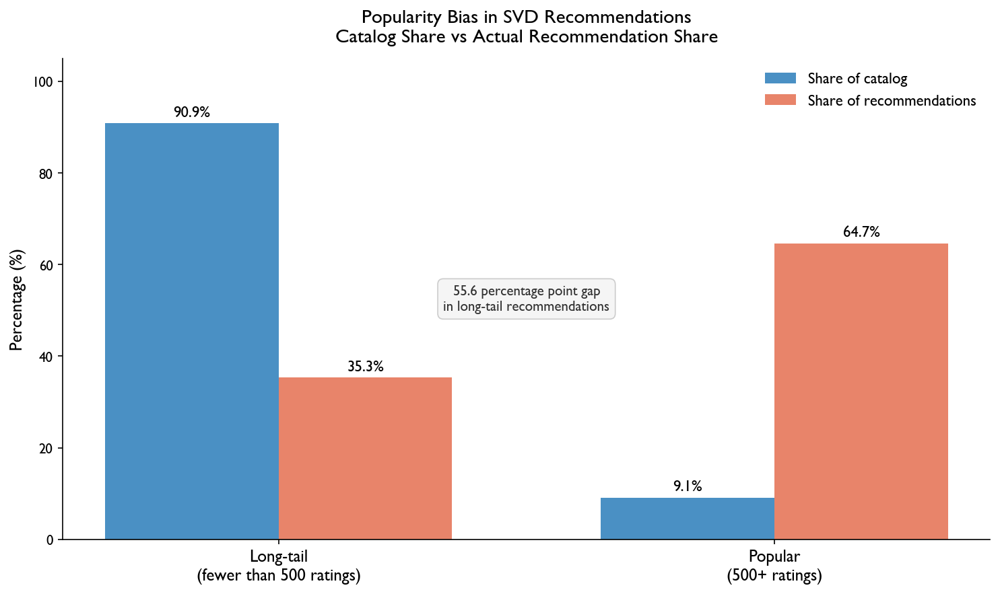

# Beyond the Top 10: How Streaming Platforms Are Hiding Movies You Would Actually Love

## You Have Seen This Before

Open Netflix or Hulu and the same titles keep showing up. You have already seen most of them, or decided they are not for you, yet they keep appearing at the top of your feed. It starts to feel less like a recommendation and more like a billboard. The frustrating part is that the platform has your entire watch history and still cannot seem to figure out what you actually want to watch next.

## Problem Statement

The problem is not that streaming platforms lack data. It is how that data gets used. Recommendation systems learn from ratings, and ratings are heavily concentrated on popular movies because those are the ones most people have seen. A film that came out quietly, never got a wide release, or just never caught on despite being genuinely good simply does not have enough ratings to register. So it never gets recommended. Meanwhile the same hundred movies cycle through everyone's feed regardless of whether those movies actually match what that person likes. The result is a feedback loop: popular movies get recommended, more people watch and rate them, and they become even more dominant the next time the algorithm runs.

## Solution Description

This project uses rating data from over 160,000 viewers across 62,000 movies to measure exactly how large this gap is. The findings are clear: popular movies make up only 9% of the full catalog but received 65% of all recommendations generated by a standard recommendation model. The other 91% of films, which includes thousands of movies that viewers would genuinely enjoy, received just 35% of recommendations. By measuring this imbalance directly and evaluating models on how fairly they treat lesser-known films, not just how accurately they predict ratings, it becomes possible to design systems that actually reflect what individual viewers want rather than what is already popular.

## Chart

**Figure 1.** Popular movies make up only 9% of the catalog but receive 65% of recommendations from a standard model. Long-tail films make up 91% of the catalog but receive just 35% of recommendations. The gap between these two bars is the popularity bias this project sets out to measure and address.