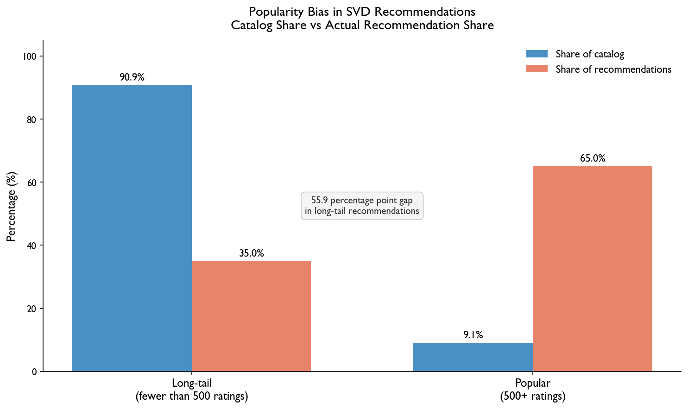

# Beyond the Top 10: How Streaming Platforms Are Hiding Movies You Would Actually Love

## Hook

Open any streaming platform and the same titles keep appearing. The recommendations feel less like personalized suggestions and more like a popularity contest. The platform knows your watch history, yet it is still showing you what everyone else is watching.

## Problem Statement

Streaming recommendation systems are not neutral. They are trained on rating data, and rating data is heavily skewed toward popular movies because those are the ones most people have already seen and rated. Lesser-known films rarely get recommended not because viewers would dislike them, but simply because they do not have enough ratings to compete. The result is a feedback loop where popular movies stay popular and everything else stays invisible. Viewers end up missing films they would have genuinely enjoyed, and the recommendation system becomes less useful over time.

## Solution Description

This project analyzes the rating behavior of over 160,000 viewers across 62,000 movies to measure exactly how severe this imbalance is. The findings are striking: popular movies make up only 9% of the full catalog but received 65% of all recommendations generated by a standard recommendation model. Meanwhile, the other 91% of films received just 35% of recommendations. By measuring this gap and evaluating recommendation systems on how fairly they treat lesser-known films, not just how accurately they predict ratings, it becomes possible to design systems that surface a more honest and useful range of movies for each individual viewer.

## Chart

**Figure 1.** Popular movies make up only 9% of the catalog but receive 65% of recommendations from a standard model. Long-tail films, which make up 91% of the catalog, receive just 35% of recommendations. This gap shows that current recommendation systems are not reflecting viewer taste, they are reflecting popularity.
